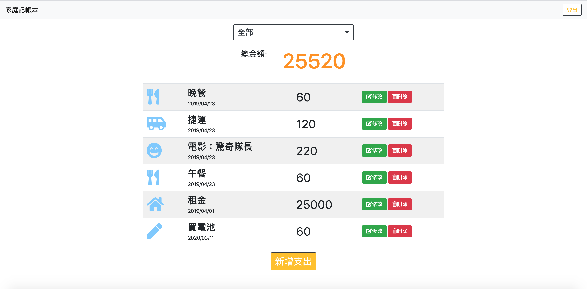
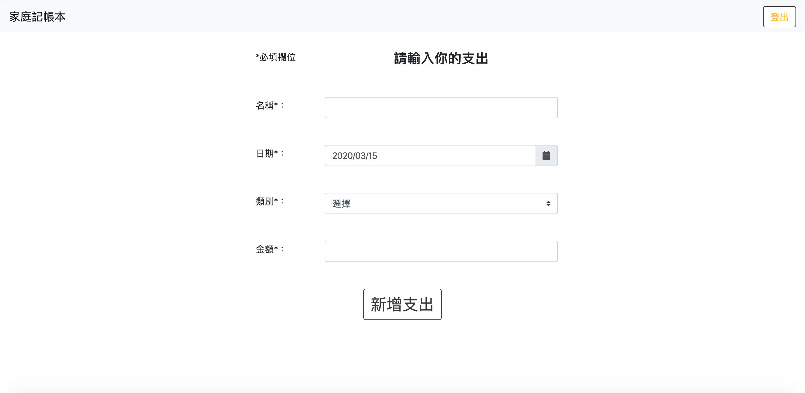
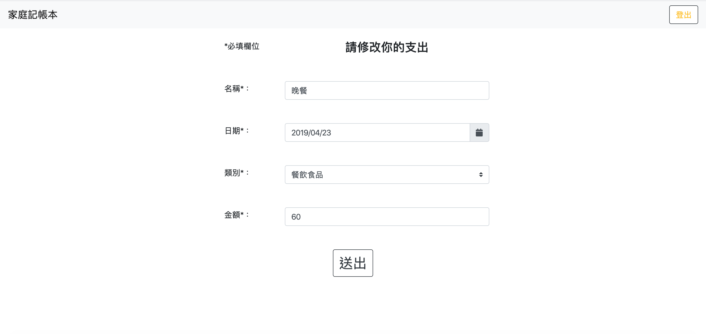

# 老爸的私房錢

##### 打造一個簡單的網路記帳工具。基本功能如下：
- 能讓老爸新增、修改與刪除「支出 (expense record，以下簡稱為 record)」。
- 每一筆支出都有「名稱」、「類別」、「日期」 與「金額 」四個屬性。

## Installing

#### NPM的使用

```
- node.js v-10.15.0
- nodemon
- Express
- Express-Handlebars
- body-parser
- Mongoose
- method-override
- passport
- passport-local
```

##### 確認本機是否安裝 [Mongodb](https://www.mongodb.com/download-center/community) 、 [Robo 3T](https://robomongo.org/)

##### 1.開啟終端機到存放專案本機位置並執行:

`git clone https://github.com/henry22/expense-tracker`

##### 2.初始設定

```
1. 切換目錄到專案: cd expense-tracker
2. 安裝套件: npm install
3. 新增種子資料
- 終端機上執行 npm run seeder
- 確認 Robo 3T 資料已經建立了
```

##### 3.執行程式

```
1. 終端機輸入: nodemon run dev
2. 開啟網頁輸入: http://localhost:3000
```

## 使用者故事
##### 使用者 (老爸) 可以：

1. 在首頁一次瀏覽所有支出的清單
2. 在首頁看到所有支出清單的總金額
3. 新增一筆支出
4. 編輯支出的所有屬性 (一次只能編輯一筆)
5. 刪除任何一筆支出 (一次只能刪除一筆)
6. 在首頁可以根據支出「類別」篩選支出；總金額的計算只會包括被篩選出來的支出總和

## 截圖

###### 1.Index 頁面/首頁



###### 2.New 頁面



###### 3.Update 頁面

