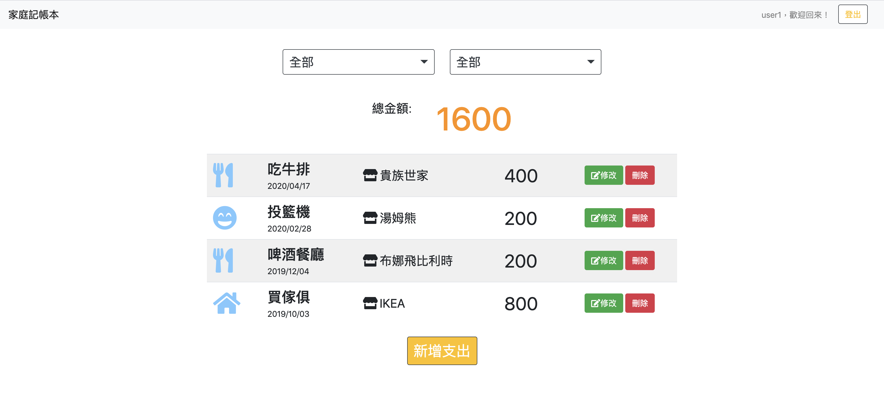
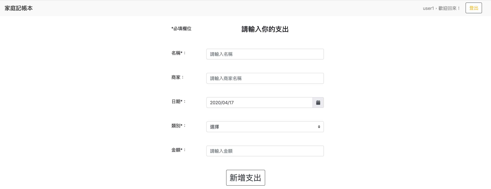
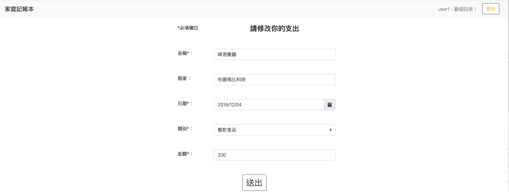

# 老爸的私房錢

##### 打造一個簡單的網路記帳工具。基本功能如下：
- 能讓老爸新增、修改與刪除「支出 (expense record，以下簡稱為 record)」。
- 每一筆支出都有「名稱」、「類別」、「日期」 與「金額 」四個屬性。

## Installing

#### NPM的使用

```
- node.js v-10.15.0
- nodemon
- Express
- Express-Handlebars
- body-parser
- mysql2
- sequelize
- sequelize-cli
- method-override
- passport
- passport-local
- passport-facebook
- bcryptjs
- connect-flash
- moment
```

##### 確認本機是否安裝 [MySql](https://dev.mysql.com/downloads/windows/installer/)

##### 1.開啟終端機到存放專案本機位置並執行:

`git clone https://github.com/henry22/expense-tracker`

##### 2.初始設定

```
1. 切換目錄到專案: cd expense-tracker
2. 切換到指定的branch: git checkout sequelize
3. 安裝套件: npm install
4. 進入Facebook開發者網站(https://developers.facebook.com/)
- 註冊個人的secret key
5. 建立.env的檔案，將個人的Facebook ID及Facebook Secrect貼在下述
- FACEBOOK_ID=<FB ID>
- FACEBOOK_SECRET=<FB SECRET>
- FACEBOOK_CALLBACK= http://localhost:3000/auth/facebook/callback
```

#### 3.修改 /config/config.json
```
- 修改 development mode 的設定，加入資料庫的名字與密碼，刪除"operatorsAliases": false

"development": {
  "username": "root",
  "password": "password",
  "database": "record_sequelize",
  "host": "127.0.0.1",
  "dialect": "mysql",
  "operatorsAliases": false
}
```

#### 4.資料庫設定
```
- 請在 MySQL Workbench 輸入下方指令，建立 expense_tracker_sequelize 資料庫

drop database if exists expense_tracker_sequelize;
create database expense_tracker_sequelize;
use expense_tracker_sequelize;
```

##### 5.建立 Users 和 Record Table

- npx sequelize db:migrate

##### 6.執行程式

```
1. 終端機輸入: npm run dev
2. 開啟網頁輸入: http://localhost:3000
```

## 使用者故事
##### 使用者 (老爸) 可以：

1. 用 email 註冊，註冊時必須指定使用者名稱
2. 登入後，使用者可以：
    * 在首頁瀏覽自己的支出記錄
    * 在首頁看到自己的支出總金額
    * 新增一筆支出
    * 編輯特定一筆支出的內容
    * 刪除特定一筆支出
3. 透過 Facebook 帳號登入
4. 在首頁瀏覽支出記錄時，可以篩選類別與日期，並看到篩選後的總金額

## 截圖

###### 1.Index 頁面/首頁



###### 2.New 頁面



###### 3.Update 頁面

